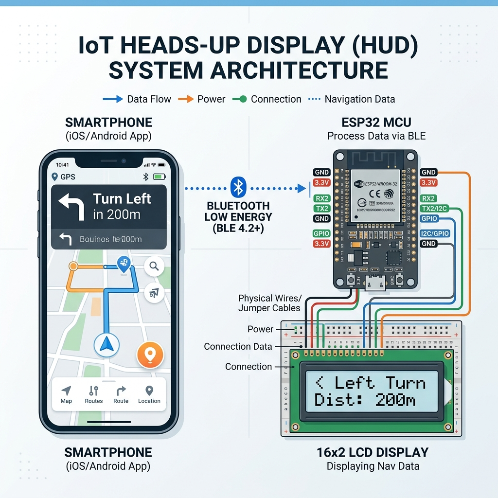

# AkmNavi (Arahnya ke Mana) 🧭🏍️

**AkmNavi (Arahnya ke Mana)** adalah proyek IoT (Internet of Things) yang dirancang untuk membangun sistem **Heads-Up Display (HUD) Sekunder** guna meningkatkan keamanan dan kenyamanan saat berkendara. Sistem ini terdiri dari **Aplikasi Android Pendamping** (React Native) dan **Perangkat Keras HUD** (ESP32 + LCD 1602 I2C). 

Aplikasi ini menyadap notifikasi petunjuk arah dari Google Maps di latar belakang, mem-parsing teks & ikon arah, lalu mengirimkan data tersebut via **Bluetooth Low Energy (BLE)** ke perangkat ESP32 untuk ditampilkan secara *real-time* dalam bentuk ikon panah kustom dan jarak tempuh. Dengan sistem ini, pengendara tidak perlu lagi sering melihat layar ponsel selama perjalanan, sehingga meminimalkan risiko kecelakaan.

---

## 📸 Rancangan & Alur Sistem

Berikut adalah diagram arsitektur dan alur data dari proyek **AkmNavi**:



### Alur Kerja Sistem:
1. **Google Maps** memunculkan notifikasi petunjuk jalan di HP Android (foreground/background).
2. **AkmNavi App** (melalui Android Notification Listener Service & Headless JS) menyadap notifikasi tersebut.
3. Aplikasi mengekstrak informasi rute: **Arah** (belok kiri, kanan, putar balik, dll.) dan **Jarak** (m, km, ft).
4. Aplikasi menggunakan algoritma **djb2 hash** untuk mengidentifikasi ikon notifikasi Maps. Jika ikon belum terkalibrasi, aplikasi menyediakan UI kalibrasi manual untuk memetakan hash tersebut ke arah yang benar. Modul Java asli (*Native Module* `IconAnalyzer`) digunakan sebagai fallback.
5. Data yang telah diringkas diformat menjadi payload sederhana (contoh: `"KIRI|200m"`) dan ditransmisikan via **Bluetooth Low Energy (BLE)**.
6. Perangkat **ESP32** menerima payload tersebut, mengurai (*parse*) string, dan mencocokkannya dengan karakter panah kustom (*Custom Character* CGRAM) di **LCD 1602**.

---

## 🛠️ Tumpukan Teknologi (Tech Stack)

Proyek ini dibangun menggunakan teknologi modern untuk menjamin performa tinggi dan latensi rendah:

### 1. Aplikasi Pendamping Android (Mobile App)
* **Framework Utama:** [React Native](https://reactnative.dev/) (v0.74.1)
* **Bahasa Pemrograman:** [TypeScript](https://www.typescriptlang.org/) (untuk tipe data yang kuat dan keandalan kode)
* **Manajemen Bluetooth:** `react-native-ble-plx` (untuk komunikasi BLE berdaya rendah)
* **Penyadap Notifikasi:** `react-native-android-notification-listener` (untuk mengambil notifikasi Google Maps)
* **Penyimpanan Lokal:** `@react-native-async-storage/async-storage` (untuk menyimpan konfigurasi kalibrasi ikon)
* **Modul Native (Java/Kotlin):** Custom `IconAnalyzer` untuk menganalisis dan mendeteksi arah ikon Maps secara lokal di sisi Android.

### 2. Perangkat Keras HUD (Firmware ESP32)
* **Bahasa Pemrograman:** C++ / Arduino Framework
* **Platform IoT:** ESP32 DevKit V1 (terintegrasi modul BLE & I2C)
* **Library Utama:**
  * `<BLEDevice.h>`, `<BLEServer.h>`, `<BLEUtils.h>`, `<BLE2902.h>` (Komunikasi BLE UART Service)
  * `<LiquidCrystal_I2C.h>` (Pengendali layar LCD karakter via bus I2C)
  * `<Wire.h>` (Protokol komunikasi I2C)

---

## 🔌 Spesifikasi Perangkat Keras & Wiring

Berikut adalah skema komponen fisik yang digunakan untuk merakit penerima visual HUD:

### Daftar Komponen
| Komponen | Spesifikasi / Deskripsi | Fungsi Utama |
| :--- | :--- | :--- |
| **ESP32 DevKit V1** | MCU 32-bit dengan BLE terintegrasi. | Pusat kendali (BLE Server), penerima payload, dan pemroses logika tampilan. |
| **LCD 1602 + I2C** | Layar 16x2 karakter dengan chip PCF8574. | Layar HUD utama. Menampilkan teks dan *Custom Character* (ikon panah). |
| **Breadboard 400 Pin** | Papan sirkuit tanpa solder. | Media penghubung purwarupa komponen. |
| **Kabel Jumper** | Kabel Female-to-Male. | Penghubung daya (5V/GND) dan jalur data (I2C) dari ESP32 ke LCD. |

### Diagram Wiring (Pinout)
Koneksi antara **ESP32 DevKit V1** dan **LCD 1602 (I2C)**:
* **VCC** (LCD I2C) ➡️ **VIN** / **5V** (ESP32)
* **GND** (LCD I2C) ➡️ **GND** (ESP32)
* **SDA** (LCD I2C) ➡️ **GPIO 21** / **SDA** (ESP32)
* **SCL** (LCD I2C) ➡️ **GPIO 22** / **SCL** (ESP32)

---

## 📡 Protokol Data (BLE Payload Format)

Untuk mengoptimalkan ukuran transmisi data dan mencegah *buffer overflow* pada memori ESP32, data rute diringkas menjadi satu baris string dengan pembatas (*delimiter*) karakter `|`:

$$\text{Format Payload} = \text{ARAH} \mid \text{JARAK}$$

### Contoh Payload & Tampilan pada LCD 1602:

| Payload via BLE | Arah Terdeteksi | Jarak Tempuh | Tampilan LCD 1602 |
| :--- | :--- | :--- | :--- |
| `KIRI\|200m` | Belok Kiri | 200 meter | ⬅️ Belok Kiri <br> Jarak: 200m |
| `KANAN\|1.5km` | Belok Kanan | 1.5 kilometer | ➡️ Belok Kanan <br> Jarak: 1.5km |
| `LURUS\|500m` | Terus Lurus | 500 meter | ⬆️ Terus Lurus <br> Jarak: 500m |
| `BALIK\|100m` | Putar Balik | 100 meter | 🔄 Putar Balik <br> Jarak: 100m |
| `SAMPAI\|0m` | Sampai | 0 meter | 🏁 Anda Telah <br> Sampai! 🏁 |

> **Catatan:** ESP32 secara otomatis memetakan nilai `KIRI`, `KANAN`, `LURUS`, `BALIK`, dan `SAMPAI` ke *custom bitmap* LCD di CGRAM untuk merender ikon panah yang presisi di baris pertama LCD.

---

## 🚀 Cara Memulai & Menjalankan

### A. Setup & Menjalankan Aplikasi Android
1. **Prasyarat:** Pastikan Anda telah mengonfigurasi [React Native Environment Setup](https://reactnative.dev/docs/environment-setup) untuk pengembangan Android.
2. **Instalasi Dependensi:**
   Masuk ke direktori `AkmNavi` dan jalankan:
   ```bash
   npm install
   ```
3. **Jalankan Metro Bundler:**
   ```bash
   npm start
   ```
4. **Jalankan Aplikasi ke HP/Emulator:**
   Hubungkan HP Android dengan mode debug aktif, lalu jalankan:
   ```bash
   npm run android
   ```
5. **Konfigurasi Akses Izin:**
   * Izinkan akses **Lokasi** dan **Bluetooth** di HP Anda.
   * Aktifkan izin **Notification Access (Notification Listener)** untuk aplikasi **AkmNavi** melalui pengaturan Android Anda agar aplikasi dapat membaca notifikasi Google Maps.

### B. Flash Firmware ke ESP32
1. Buka folder `ESP32_HUD` dan buka file `ESP32_HUD.ino` menggunakan **Arduino IDE**.
2. Instal library **LiquidCrystal_I2C** dari Library Manager.
3. Pilih Board **ESP32 Dev Module** dan Port COM yang sesuai.
4. Klik **Upload** untuk mem-flash kode ke ESP32.
5. Buka Serial Monitor (baud rate `115200`) untuk melihat debug status BLE.
6. LCD akan menampilkan `"Menunggu Koneksi BLE..."`.

---

## 🎯 Panduan Kalibrasi Ikon Navigasi

Google Maps menggunakan berbagai macam bentuk ikon panah notifikasi (berbentuk base64). Aplikasi **AkmNavi** menyediakan fitur kalibrasi instan:
1. Hubungkan aplikasi ke perangkat ESP32 dengan menekan tombol **Scan & Connect**.
2. Mulai navigasi rute di Google Maps.
3. Ketika notifikasi pertama kali masuk, jika ikon rute belum terdaftar di database lokal aplikasi, status kalibrasi akan menunjukkan `Ikon menggunakan Fallback`.
4. Anda dapat memilih tombol kalibrasi arah yang benar (`Kiri`, `Lurus`, `Kanan`, `Balik`, `Sampai`) pada layar aplikasi.
5. Konfigurasi kalibrasi akan disimpan secara permanen di memori lokal ponsel (`AsyncStorage`), dan dapat dibagikan (*share*) atau di-*reset* kapan saja.
